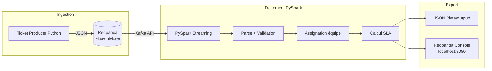

# Projet 9 - Infrastructure Cloud InduTechData

POC pour le projet OpenClassrooms : modélisation d'une infrastructure cloud hybride et pipeline de traitement de tickets en temps réel.

## Ce que fait ce projet

**Exercice 1** : schéma d'architecture cloud hybride pour InduTechData. L'idée est d'intégrer leur SI on-premise (SQL Server, SAN, AD) avec des services AWS via Redpanda pour le streaming des données IoT.

**Exercice 2** : un petit pipeline de streaming conteneurisé avec Redpanda + PySpark. Un producteur Python génère des tickets clients et les envoie dans un topic Redpanda. PySpark consomme le flux, enrichit chaque ticket (équipe support + délai SLA) et écrit les résultats en JSON.

## Stack

- Redpanda (broker Kafka-compatible)
- PySpark Structured Streaming
- Docker Compose
- Python 3.11

## Lancer le projet

Avoir Docker Desktop installé, puis :

```bash
docker compose up --build -d
```

La console Redpanda est accessible sur `http://localhost:8080` — on peut y voir les messages qui arrivent dans le topic `client_tickets`.

Pour les tests :

```bash
python -m pytest tests/
```

## Structure

```
src/
  producer/   → ticket_producer.py + Dockerfile
  processor/  → spark_processor.py + Dockerfile
tests/        → tests unitaires
docs/exercice1/ → schéma d'architecture (PDF + PNG)
```

## Flux de données (Exercice 2)



## Vidéo de démonstration

Lien : *(à compléter)*
