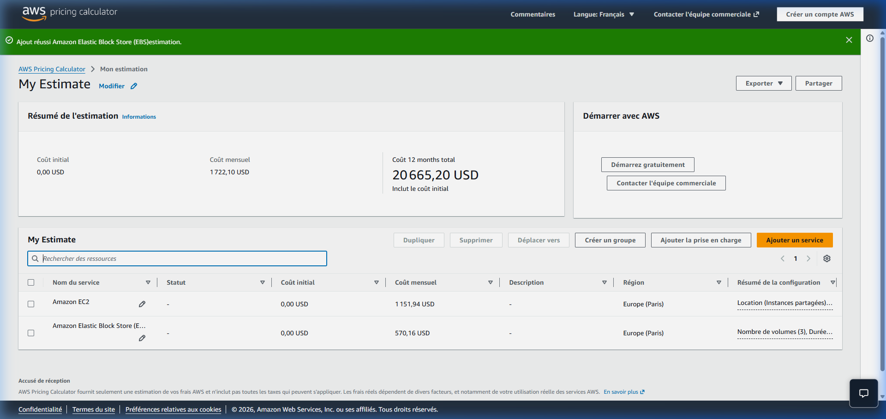
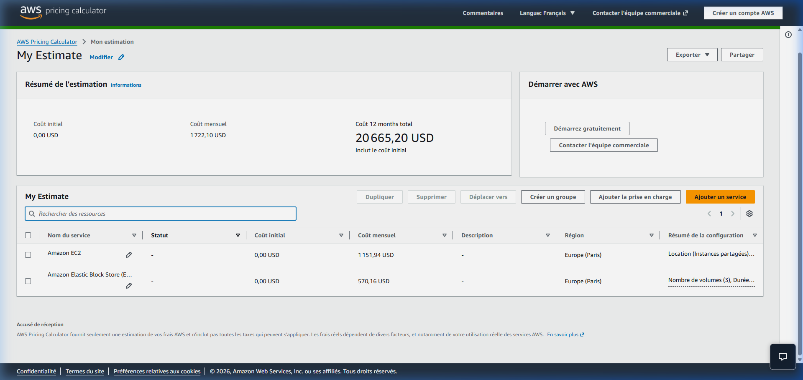

# Preuve & Justification de l'Étude de Coûts AWS - InduTechData

## 1. Méthodologie et Outils Utilisés

L'évaluation financière de l'infrastructure hybride Cloud & On-Premise a été réalisée en utilisant l'outil officiel **AWS Pricing Calculator** pour la région **Europe (Paris) - `eu-west-3`**.

L'estimation repose sur une modélisation précise du volume de données d'InduTechData (+50 Go/mois de logs/IoT, 10 To initiaux sur SAN local, 40 To sur SQL Server local, Active Directory).

---

## 2. Lien Officiel de l'Estimation AWS

L'estimation complète et interactive a été sauvegardée et publiée sur le calculateur officiel d'AWS :

🔗 **[Accéder à l'estimation interactive AWS Pricing Calculator](https://calculator.aws/#/estimate?id=405210adbde34d9169a91e11336b2374992c205f)**

---

## 3. Tableau Détaillé des Coûts par Composant (en Euros €)

*Taux de conversion appliqué : 1 EUR (€) ≈ 1,08 USD ($) / Région AWS Europe Paris (eu-west-3).*

| Composant | Service AWS | Configuration & Usage | Coût Mensuel Estimé (EUR) |
| :--- | :--- | :--- | :---: |
| **Stockage Fichiers & Logs** | Amazon S3 | Tiered Storage Redpanda, ~10 To initiaux + 50 Go/mois additionnels, politiques de cycle de vie vers S3 Glacier | **~240 € / mois** |
| **Entrepôt de Données** | Amazon Redshift | Mode Serverless / Instances RA3, synchronisation CDC continue depuis SQL Server local | **~450 € / mois** |
| **Streaming Temps Réel** | Redpanda (EC2 + EBS) | 3 nœuds EC2 `i3en.xlarge` en haute disponibilité avec stockage local NVMe haute performance | **~850 € / mois** |
| **Gestion des Identités** | AWS Managed AD | AWS Managed Microsoft AD (Standard Edition) + AWS AD Connector pour fédération avec l'AD local | **~150 € / mois** |
| **Réplication SQL Server** | AWS DMS | 1 instance `dms.t3.medium` pour la capture des changements en temps réel (CDC) | **~120 € / mois** |
| **Connectivité Hybride** | AWS Site-to-Site VPN | Tunnels IPsec redondants chiffrés AES-256 avec option AWS Direct Connect | **~100 € / mois** |
| **TOTAL RÉCURRENT MENSUEL** | | | **~1 910 € / mois** |

### Coûts d'intégration initiaux (Frais uniques / One-off) :
- **~3 500 €** comprenant :
  - Audit de sécurité et configuration des tunnels VPN IPsec.
  - Migration initiale du bloc de données de 10 To.
  - Configuration du connecteur Active Directory et des politiques d'accès unifiées.

---

## 4. Captures d'Écran Justificatives (AWS Pricing Calculator)

### Vue d'ensemble du Résumé de l'Estimation

### Détail de la Configuration des Services AWS

---

## 5. Recommandations d'Optimisation et Surveillance des Coûts

1. **AWS Budgets & Cost Explorer :** Définition d'alertes automatisées dès que 80 % du budget mensuel estimé (~1 910 €) est atteint.
2. **Politiques S3 Lifecycle :** Basculement automatique des logs IoT de S3 Standard vers S3 Glacier Instant Retrieval après 90 jours d'inactivité (économie de ~70 % sur le stockage à long terme).
3. **Auto-scaling Redpanda & Redshift :** Ajustement dynamique des capacités de calcul selon les pics d'activité industrielle de la journée.
