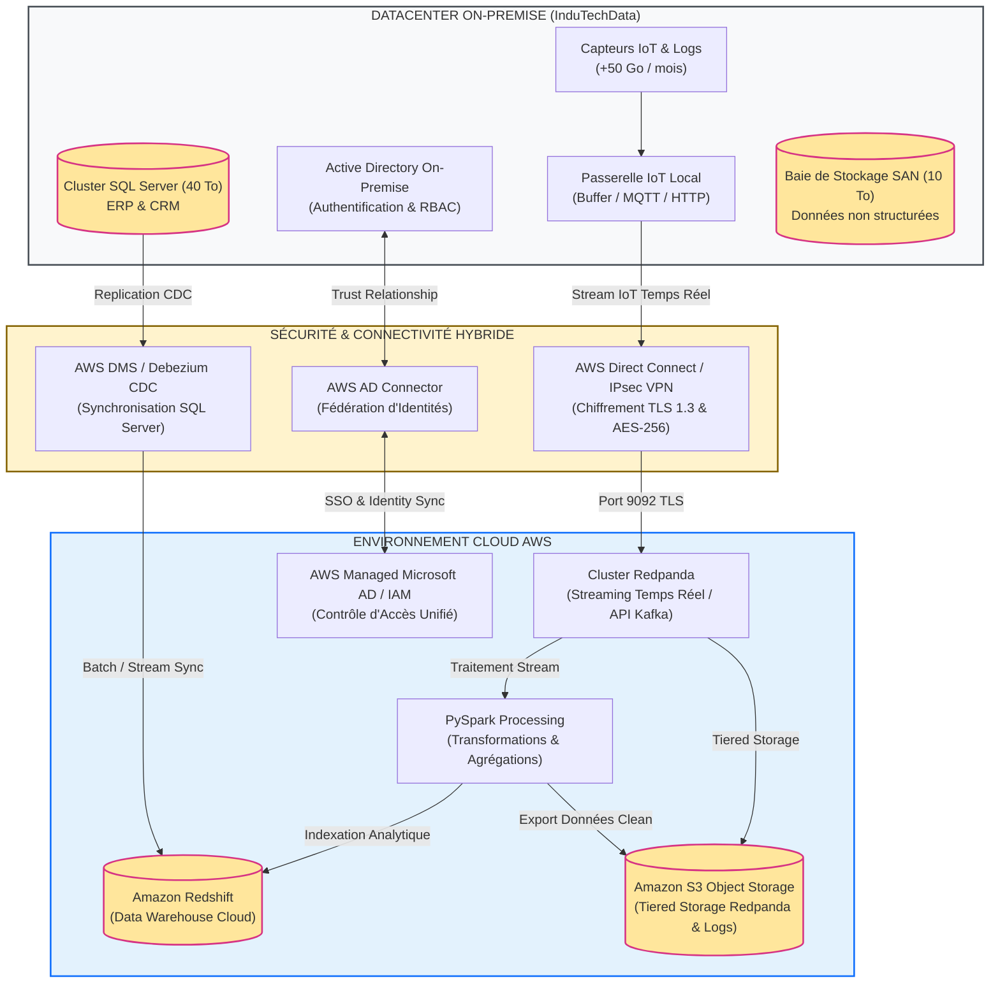

# Évaluation de Compatibilité et Choix d'Architecture Cloud Hybride - InduTechData

## Executive Summary

InduTechData fait face à une croissance mensuelle importante de ses données (+50 Go/mois) issues de capteurs IoT et de journaux système, mettant sous pression l'infrastructure *on-premise* existante (Cluster SQL Server 40 To, Baie SAN 10 To, Active Directory). 
Ce document présente l'évaluation technique et organisationnelle de la solution hybride proposée, combinant l'écosystème cloud **AWS** et la plateforme de streaming temps réel **Redpanda**.

---

## Schéma d'Architecture Cloud Hybride (Mermaid)

---

## 1. Justification des Composants Cloud Sélectionnés

### 1.1 Stockage de Données Non Structurées : Amazon S3 (Simple Storage Service)
* **Description** : Stockage d'objets hautement disponible et résilient.
* **Justification & Scalabilité** : Amazon S3 offre une durabilité de 99,999999999% (11 nines) et une capacité quasi illimitée. Il permet d'absorber l'augmentation mensuelle de 50 Go sans surdimensionner le matériel local.
* **Interopérabilité avec Redpanda** : Redpanda intègre nativement le *Tiered Storage* vers Amazon S3. Les données récentes restent en mémoire/NVMe local dans Redpanda, tandis que les données historiques sont automatiquement déchargées vers S3 sous forme de blocs d'objets, optimisant considérablement les coûts.
* **Sécurité** : Chiffrement automatique au repos (AES-256 via AWS KMS) et politiques d'accès strictes (IAM Bucket Policies).

### 1.2 Entrepôt de Données (Data Warehouse) : Amazon Redshift
* **Description** : Entrepôt de données analytique en colonne supportant des requêtes SQL complexes sur plusieurs pétaoctets.
* **Synchronisation avec SQL Server On-Premise** : 
  * La synchronisation s'effectue via **AWS Database Migration Service (DMS)** avec capture des changements en temps réel (**CDC - Change Data Capture**), ou via des connecteurs Kafka/Redpanda (**Debezium SQL Server Connector**).
  * Les données de l'ERP et du CRM hébergées sur le cluster SQL Server *on-premise* sont ainsi répliquées en continu vers Redshift sans impacter les performances de production.

### 1.3 Traitement des Données en Temps Réel : Redpanda
* **Description** : Plateforme de streaming d'événements compatible avec l'API Apache Kafka, développée en C++.
* **Justification** :
  * **Simplicité & Performance** : Redpanda ne nécessite pas de JVM ni de ZooKeeper/KRaft externe, réduisant l'empreinte mémoire et supprimant les pauses dues au Garbage Collector. Il offre des latences p99 extrêmement faibles pour les flux d'ingestion IoT et de logs.
  * **Efficacité Opérationnelle** : Déploiement ultra-rapide (binaire unique ou conteneur Docker), gestion intégrée du stockage multi-niveaux.

### 1.4 Sécurisation et Gestion des Accès : AWS Managed Microsoft AD & AD Connector
* **Description** : Service d'annuaire Microsoft Active Directory géré dans AWS.
* **Gestion Unifiée des Identités** : 
  * Utilisation d'un **AWS AD Connector** ou d'une relation d'approbation (Trust Relationship) entre l'Active Directory *on-premise* et AWS Managed AD via une connexion réseau sécurisée (IPsec VPN ou AWS Direct Connect).
  * Garantit l'authentification unique (SSO) et une gestion centralisée des permissions sur l'ensemble de l'infrastructure hybride (fichiers S3, accès Redshift, consoles d'administration).

---

## 2. Analyse de Compatibilité avec le SI On-Premise

### 2.1 Sécurité et Conformité
* **Protection en Transit** : Tous les flux inter-sites (IoT, réplication de données, accès utilisateurs) transitent via des tunnels VPN IPsec chiffrés en **AES-256** ou via **AWS Direct Connect** avec chiffrement MACsec / TLS 1.3. Les communications avec Redpanda utilisent le protocole **SSL/TLS**.
* **Protection au Repos** : Chiffrement systématique via **AWS KMS** (Key Management Service) avec rotation automatique des clés.
* **Gouvernance des Accès** : L'intégration AD-IAM garantit le respect du principe du moindre privilège sur l'ensemble du SI.

### 2.2 Interopérabilité et Automatisation
* **Intégration d'Ingestion** : Les passerelles IoT transmets les métriques aux topics Redpanda via des agents légers (ex: Telegraf, Vector) ou directement en HTTP/Kafka API.
* **Pipelines ETL/ELT Automatisés** : 
  * Redpanda transmet les flux en continu vers PySpark pour le nettoyage et l'enrichissement.
  * PySpark déverse les données structurées dans Amazon Redshift pour l'analyse décisionnelle et dans Amazon S3 pour l'archivage long terme.

### 2.3 Scalabilité et Gestion des Coûts

#### Stratégie de Scalabilité :
L'architecture hybride sépare le stockage du calcul. Redpanda et PySpark peuvent être dimensionnés dynamiquement (auto-scaling) en fonction des pics d'activité IoT.

#### Recommandations pour la Surveillance des Coûts :
1. **AWS Budgets & Cost Explorer** : Configuration d'alertes prédictives en cas de dépassement de budget mensuel.
2. **AWS CloudWatch** : Supervision en temps réel de l'utilisation des ressources et création de métriques personnalisées.
3. **Politiques de Rétention S3 Lifecycle** : Transition automatique des objets S3 Standard vers S3 Glacier Instant Retrieval après 90 jours pour réduire la facture de stockage.

---

## 3. Estimation des Coûts (Estimatif Initial & Récurrent)

*Remarque : Les estimations ci-dessous sont basées sur le tarificateur AWS Pricing Calculator pour la région Europe (Paris).*

| Composant Cloud | Usage Estimé | Coût Mensuel Estimé (EUR) |
| :--- | :--- | :--- |
| **AWS Direct Connect / Site-to-Site VPN** | Tunnels IPsec redondants + transfert | ~100 € |
| **Amazon S3 (Standard + Lifecycle)** | ~10 To initiaux + 50 Go/mois additionnels | ~240 € |
| **Redpanda Cluster (Instances EC2 i3en.xlarge)** | 3 nœuds haute disponibilité avec NVMe local | ~850 € |
| **Amazon Redshift (Serverless / ra3.xlarge)** | Ingestion CDC et requêtes analytiques journalières | ~450 € |
| **AWS Managed AD / AD Connector** | Annuaire géré hybride | ~150 € |
| **AWS DMS (Database Migration Service)** | Synchronisation CDC continue SQL Server | ~120 € |
| **Total Récurrent Mensuel** | | **~1 910 € / mois** |

*Coûts d'intégration initiaux (One-off)* : ~3 500 € (frais de configuration VPN, migration initiale 10 To, audit de sécurité).

---

## 4. Bilan : Avantages, Limitations et Points de Vigilance

### Avantages Majeurs
* **Performance et Latence** : Redpanda garantit un traitement fluide des flux IoT volumineux sans surcharge sur le SI local.
* **Souplesse du Stockage** : Élimination du besoin d'investir dans une nouvelle baie SAN *on-premise*.
* **Continuité d'Utilisation** : Conservation des serveurs ERP/CRM et Active Directory locaux sans perturbation pour les équipes métiers.

### Limitations & Points de Vigilance
* **Bande Passante Réseau** : Le transfert continu de 50 Go/mois nécessite une ligne réseau stable avec de la bande passante dédiée.
* **Complexité Observabilité** : Nécessite une supervision unifiée (logs combinés on-premise + cloud).

---
*Document rédigé dans le cadre du projet d'infrastructures cloud pour InduTechData.*
